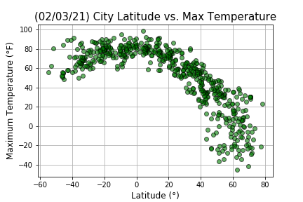
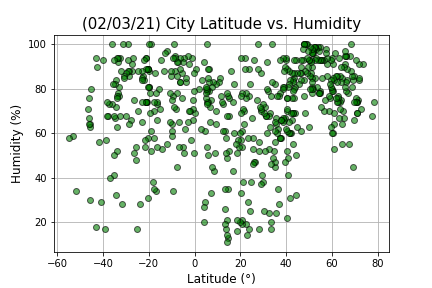
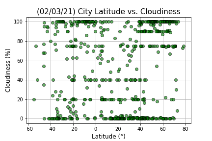
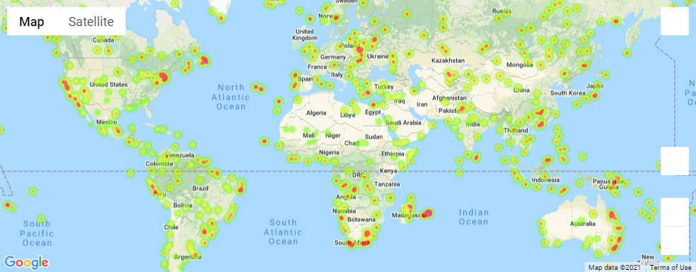
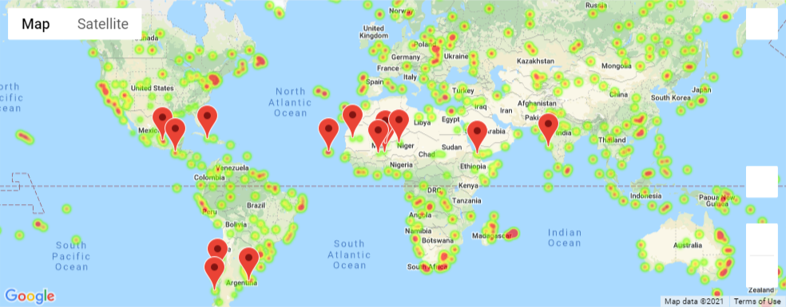

# python-api-challenge
The scripts in this repositories use API keys from [Google](https://console.developers.google.com/) and [OpenWeather](https://openweathermap.org/api).
The scripts relies on the following python packages: matplotlib, pandas, numpy, requests, time, datetime, scipy and gmpas. 

## [WeatherPy](./WeatherPy)
the script uses the OpenWeather API to visualize the weather in more than 500 cities across the world at randomly sampled distance from the equator. Once all the data are gathered the following scatter plots are generated and the dataframe is saved in a [csv file](./WeatherPy/output_data/cities.csv):
1.  \
this plot is showing the variation of temperature with the latitude, it is possible to observe that the highest temperature on February 3, 2021 were in the equatorial area (between -20 and 20 degree of latitude).
2.  \
this plot is showing the variation of humidity with the latitude, it is not possible to observe any clear trend between humidity and latitude.
3.  \
this plot is showing the variation of cloudiness with the latitude, it is not possible to observe any clear trend between cloudiness and latitude.
4.   \
this plot is showing the variation of cloudiness with the latitude, it is not possible to observe any clear trend between wind speed and latitude.
\
Additionally, a linear regression was performed for Temperature, Humidity, cloudiness and wind speed with respect to the latitudude for each hemisphere along with the evaluation of the pearson coefficient. The main observations reported in the [jupyther noteboor](./WeatherPy/WeatherPy.ipynb) are reported here for your convenience:
1. There is a good negative correlation between temperature and Latitude in the northern emisphere. Pearson coefficient of -0.86.\
 
2. The correlation between temperature and latitude in the south emisphere is positive but it is less strong than in the northern since the pearson correlation coefficient is only 0.52.
3. There is no correlation between cloudiness or wind speed and Latitude in either emispheres.

## [VacationPy](./VacationPy)
The [csv file](./WeatherPy/output_data/cities.csv) produced running [WetherPy.ipynb](./WeatherPy/WeatherPy.ipynb) was used as input of the [VacationPy.ipynb](./VacationPy/VacationPy.ipynb) script. The cities weather data were read and a humidity heathmap was generated using the gmaps module: \
 \
Successively, the cities dataset was filtered according to the ideal weather for a vacation according to the following parameters:
1. Temperature between 70 °F and 80 °F.
2. Humidity lower than 80%.
3. Cloudiness of 0%.
4. Wind Speed lower than 10 m s-1
Finally, using the latitude and the longitude of these cities a search  for hotels withing 5000 meters of the coordinate was done (by reverse geocoding). A list of hotel was received in response for all the cities with the exception of two that were then removed from the analysis. The heatmap was updated with a markdown of the position of the hotels:

### Copyright

Trilogy Education Services © 2020. All Rights Reserved.
